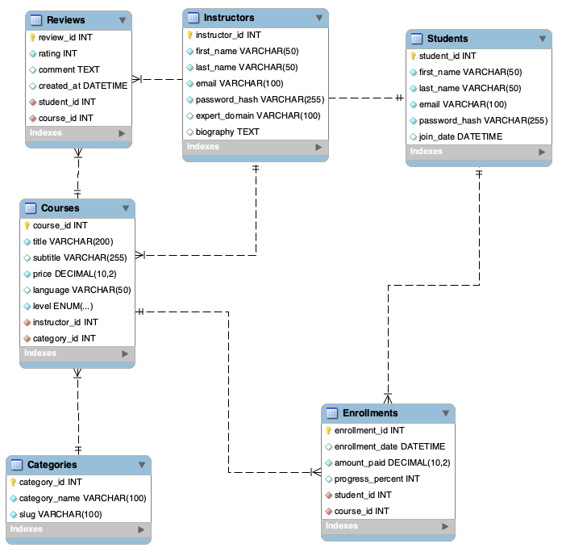

# Database Design

# DBMS_Project_FSM
This is a project done by our group submitted to Mr Ashok Harnal as part of our course requirements 
Organistaion Chosen : Udemy 

Udemy Clone Database Management System

A comprehensive Relational Database Management System (RDBMS) design for an online e-learning platform similar to Udemy. This project models complex real-world educational scenarios, including instructor payouts, dynamic coupon logic, course hierarchies, and student progress tracking.

👥 Group Members

Aranya Singh - 341065

Gursimran Singh - 341078

Shreya Singh - 341106

